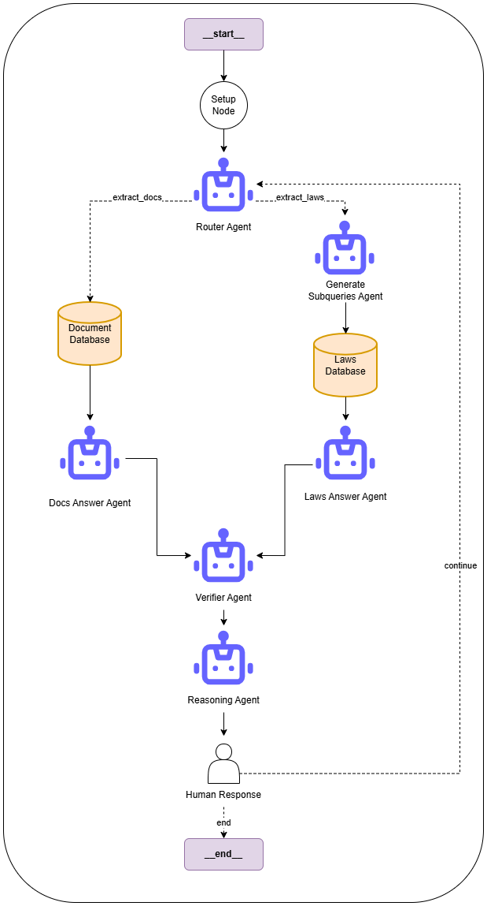

# Project: Laws & General Documents Multi-Agent Based System

This project aims to build a robust multi-agent system for legal question answering and document analysis under the course Project 3 with Associate Professor Pham Van Hai at Hanoi University of Science and Technology.

## 1. General Architecture



### Workflow Overview:
1.  **Router Agent**: The entry point. It uses a trained PyTorch model (`PathClassifier`) to classify the user's query into one of two paths:
    *   `extract_laws`: For general legal questions requiring external legal knowledge.
    *   `documents`: For questions related to specific files uploaded by the user.
2.  **Sub-Agents**:
    *   **Generate Subqueries Agent**: Decomposes complex legal queries into smaller, retrievable sub-queries.
    *   **Retrieve Laws Agent**: Uses the sub-queries to fetch relevant legal contexts from a vector database.
    *   **Laws Agent**: Synthesizes the retrieved legal information to answer the user's question.
    *   **Documents Agent**: Processes and answers questions based on the context of uploaded documents (e.g., PDFs).
    *   **Verifier Agent**: Validates the generated answers for accuracy.
    *   **Reasoning Agent**: Provides logical reasoning steps for complex deductions.

The system uses **Google Gemini** (via `ChatGoogleGenerativeAI`) as the underlying LLM for generation and reasoning.

## 2. File Explanations

### `multi_agent_system/`
This folder contains the core logic for the advanced multi-agent implementation.
*   **`multi_agent.py`**: The main entry point that defines the LangGraph workflow, nodes, and edges. It initializes the `AgentState` and orchestrates the execution flow.
*   **`router_agent.py`**: Contains the logic for the Router. It loads the trained `path_classifier_model.pth` to decide the execution path.
*   **`generate_subqueries_agent.py`**: An agent responsible for breaking down a user query into multiple search queries to improve retrieval coverage.
*   **`retrieve_laws_agent.py`**: Handles the retrieval of legal documents/articles based on the generated sub-queries.
*   **`laws_agent.py`**: The specialist agent that formulates answers using the retrieved legal context.
*   **`documens_agent.py`**: The agent dedicated to answering questions based on user-uploaded files (RAG on specific docs).
*   **`verifier_agent.py`**: An agent designed to critique and verify the correctness of the generated response.
*   **`reasoning_agent.py`**: An agent focused on providing step-by-step reasoning for the answer.
*   **`extract_docs_agent.py`**: Helper agent/module for extracting content from documents.
*   **`visualize_system.ipynb`**: A notebook to visualize the LangGraph structure.
*   **`agent_evaluation.ipynb` & `router_evaluation.py`**: Tools for evaluating the performance of the agents and the router.

### `single_agent_system/`
This folder contains the single agent prototype of the project.
*   **`app.py`**: A Streamlit web application serving as the user interface for the single-agent version.
*   **`agent.py`**: The implementation of the single monolithic agent.
*   **`ChatbotLuatPhap.ipynb`**: A notebook for testing and prototyping the chatbot logic.
*   **`index.py`**: Logic for indexing documents for retrieval.
*   **`extractfile.py`**: Utilities for parsing PDF/text files.
*   **`config.py`**: Configuration settings for the single-agent system.

### Root Directory
*   **`classifier_based_path_classifier_training.py`**: The training script for the Router's classification model.
*   **`create_laws_100k_index.ipynb`**: Script for creating the vector index of 100000 laws.
*   **`models/`**: Stores trained router neural network model.
*   **`dataset/`**: Contains the dataset used for training the classifier, the hsnw index and corresponding data for laws.
*  **`requirements.txt`**: Lists the Python dependencies for the project.
*  **`uploaded_files/`**: Directory for storing user-uploaded files to the system (currently contains two sample documents).

## 3. Development Strategy

The project followed an development strategy with two main phases:

1.  **Single-Agent System (Phase 1)**:
    *   Initially, I deployed a **Single-Agent System** (located in `single_agent_system/`).
    *   This version is used validate the basic RAG (Retrieval-Augmented Generation) pipeline and user interface using Streamlit.

2.  **Multi-Agent System (Phase 2)**:
    *   To improve accuracy, scalability, and handling of complex queries, I transitioned the project to a **Multi-Agent System** (located in `multi_agent_system/`).
    *   This architecture decomposes the problem into specialized sub-tasks (Routing, Retrieval, Reasoning, Verification).
    *   This transition allows for better control over the logic flow, more precise retrieval strategies (via sub-queries), and the ability to handle different types of requests (General Law vs. Specific Documents) more effectively.

## 4. How to Run

### Prerequisites
- Python 3.10 or higher
- A Google Gemini API Key

### Step 1: Install Dependencies
Open a terminal in the project root (`projectcode`) and run:
```bash
pip install -r requirement.txt
```

### Step 2: Setup Data Files
The system requires specific data files for retrieval which are too large for to upload to Github.
1.  Download the `laws_first_100k_hnsw_v1.index` and `laws_first_100k.json` files from the provided Google Drive link [here](https://drive.google.com/drive/folders/14o4xibysP3LD35WDEtTgpditDcz1ewI4?usp=sharing).
2.  Place both files inside the **`dataset/`** folder.

### Step 3: Setup Environment Variables
1.  Create a new file named **`.env`** in the root directory (`projectcode/`).
2.  Add your Google API Key to the file:
    ```env
    GOOGLE_API_KEY=your_api_key
    ```

### Step 4: Run the System
To start the multi-agent system, run the following command from the root directory:
```bash
python multi_agent_langgraph/multi_agent.py
```
